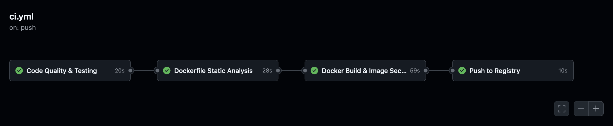
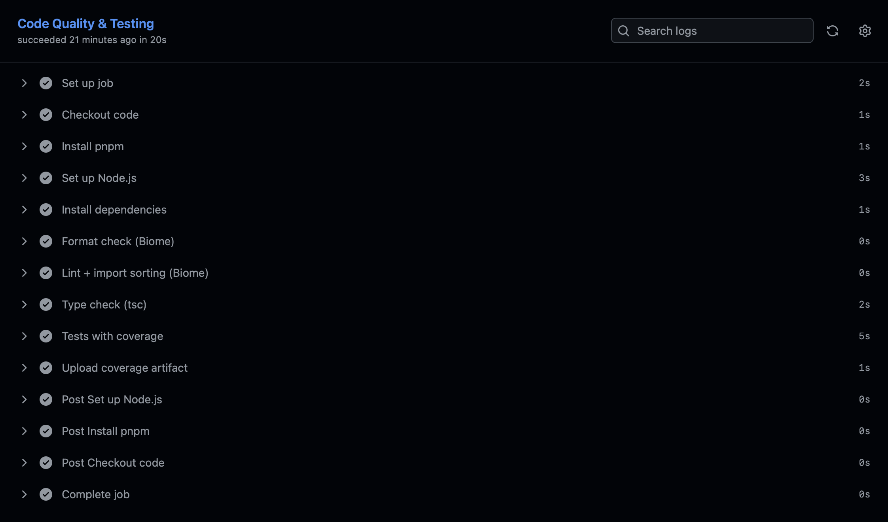
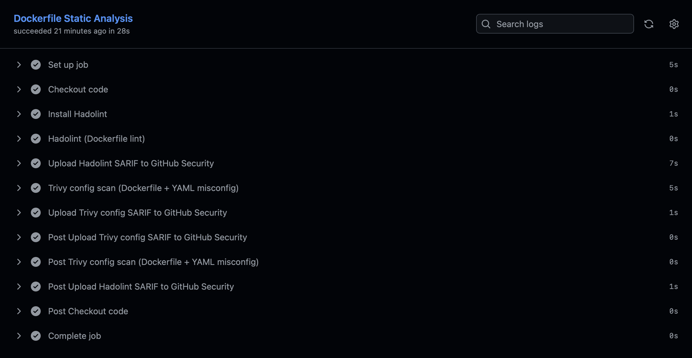
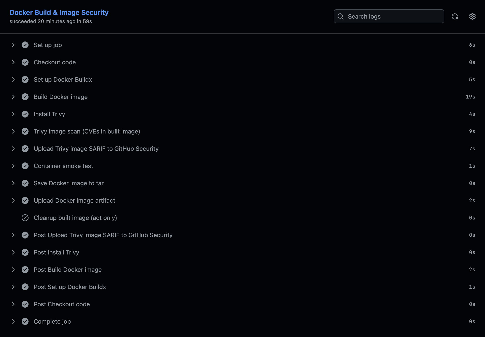
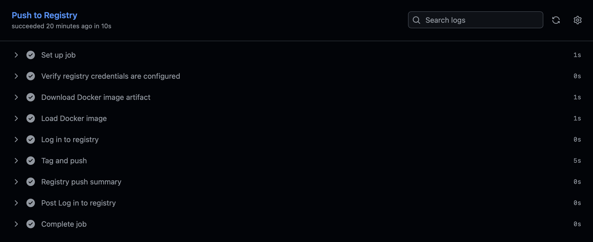
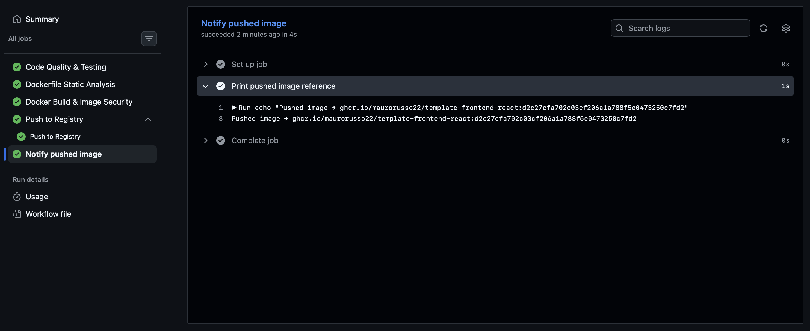

# template-frontend-react

Standardized template for React frontend projects. Clone it, rename it, and start building — CI/CD pipeline, Docker setup, pre-commit hooks, and security scanning work out of the box.

## When to use this template

**Good fit:**
- Single-page applications (SPAs)
- Internal dashboards and admin panels
- Client-facing web apps with React

**Not a fit:**
- Server-side rendering (use Next.js or Remix instead)
- Mobile apps (use React Native)
- Static sites with no interactivity (use Astro or plain HTML)
- Component libraries or design systems (use a dedicated library setup with Storybook)
- Fullstack apps with a backend API (pair this template with a backend template instead)

## What's included

| Component | Tool | What it does |
| --------- | ---- | ------------ |
| Build & dev server | Vite | Fast HMR, native ESM, production bundling |
| UI framework | React 19 + TypeScript (strict) | Component-based UI with compile-time type safety |
| Package manager | pnpm | Fast, strict (no phantom deps), disk-efficient |
| Linter & formatter | Biome | Single Rust-based tool replacing ESLint + Prettier (~100x faster) |
| Testing | Vitest + React Testing Library | Unit and component tests with 80% coverage threshold |
| Routing | React Router v7 | Client-side routing with 3 demo pages (Home, Items, NotFound) |
| Scoped styling | CSS Modules | Zero-runtime scoped class names, built into Vite |
| Production serving | nginx on Alpine | Lightweight static file server with SPA fallback and health endpoint |
| Containerization | Multi-stage Dockerfile | Build with Node, serve with nginx. Non-root, digest-pinned images |
| CI/CD pipeline | GitHub Actions (4 jobs + 1 reusable workflow) | Format, lint, typecheck, test, Dockerfile lint, Docker build, Trivy scan, smoke test, registry push, push notification |
| Security scanning | Hadolint + Trivy | Dockerfile linting, config misconfig detection, image CVE scanning with SARIF upload |
| Dependency updates | Dependabot | Weekly automated PRs for npm, Docker, and GitHub Actions |
| Pre-commit hooks | pre-commit | Biome check, typecheck, gitleaks secret scanning, conventional commits |
| Internal docs | Git submodule | Private `docs-internal/` repo for non-client-facing documentation |
| Code review | PR template + CODEOWNERS | Standardized PR format, auto-assigned reviewers by path |

## Setup: Starting a new project from this template

### 1. Create a new repo

**Option A — GitHub "Use this template" button:**

Click **Use this template** → **Create a new repository** on the template's GitHub page. This creates a fresh repo with no git history from the template.

**Option B — Manual clone:**

```bash
git clone https://github.com/<org>/template-frontend-react.git my-new-app
cd my-new-app
rm -rf .git
git init
git remote add origin https://github.com/<org>/my-new-app.git
```

### 2. Rename the project

Update these three places:

| File | Field | Change to |
| ---- | ----- | --------- |
| `package.json` | `"name"` | Your app name (e.g., `"my-new-app"`) |
| `.github/workflows/ci.yml` | `APP_NAME` and `DOCKER_IMAGE_NAME` env vars | Your app name |
| `index.html` | `<title>` | Your app title |

### 3. Install dependencies

```bash
pnpm install
```

### 4. Install pre-commit hooks

`pre-commit` is a Python tool — install it system-wide if you haven't already:

```bash
brew install pre-commit   # macOS
# or: pip install pre-commit
```

Then install the git hooks:

```bash
pre-commit install
pre-commit install --hook-type commit-msg
```

### 5. Initialize the docs submodule

```bash
git submodule update --init
```

This requires access to the private `docs-internal` repo. See [Internal Documentation](#internal-documentation-submodule) for details.

### 6. Verify everything works

```bash
pnpm check              # Biome lint + format + import sorting
pnpm typecheck           # TypeScript type check
pnpm test:coverage       # Tests with ≥80% line coverage
pnpm build               # Production build → dist/
```

### 7. Configure registry secrets and push to GitHub

Set up registry credentials (see [Registry Configuration](#registry-configuration)), then push:

```bash
git push -u origin main
```

Wait for the first CI run to complete green, **then** configure branch protection on `main`. This ordering is required because GitHub's "Require status checks" dropdown is populated from historical workflow runs — checks that have never executed are not selectable.

## Branch Protection on `main`

GitHub does **not** carry branch protection rules across template copies. Every new repo created from this template must configure branch protection manually.

**When:** After the first CI run completes green on GitHub (not before — the status checks won't be selectable).

**Where:** Settings → Branches → Add branch protection rule → Branch name pattern: `main`

**Rules to enable:**

| Rule | Why |
| ---- | --- |
| Require a pull request before merging | No direct pushes to `main` |
| Require approvals (minimum 1) | At least one reviewer |
| Require status checks to pass before merging | Select: `quality`, `dockerfile-security`, `build` |
| Require branches to be up to date before merging | PR must be synced with latest `main` |
| Do not allow force pushes | Protect commit history |
| Do not allow deletions | Protect the branch |
| Require linear history (recommended) | Forces squash or rebase merges, no merge commits |

The `push` job only runs on `main` after merge, so it does not appear in the status checks dropdown — this is expected.

## How to customize

### Adding pages

Create a new folder under `src/pages/` with the component and its CSS module:

```
src/pages/Settings/
├── Settings.tsx
└── Settings.module.css
```

Then add a route in `src/router/index.tsx`:

```tsx
<Route path="/settings" element={<Settings />} />
```

And add a nav link in `src/components/Header/Header.tsx`.

### Adding components

Create a new folder under `src/components/` following the same pattern:

```
src/components/Button/
├── Button.tsx
└── Button.module.css
```

Import with the `@/` path alias: `import { Button } from "@/components/Button/Button"`.

### Adding a CSS framework (e.g., Tailwind)

Install the framework and configure it according to its Vite integration docs. CSS Modules can coexist with utility frameworks — remove `.module.css` files only for components you've migrated.

### Adding API integration

Install a fetch library or use the built-in `fetch` API. The Items page demonstrates the state management pattern — replace the `useState` in-memory storage with API calls (e.g., `useEffect` for fetching, form handlers for mutations).

### Changing the Node version

Update in **three places**:

| File | What to change |
| ---- | -------------- |
| `.github/workflows/ci.yml` | `NODE_VERSION` env var |
| `Dockerfile` | `FROM node:<version>-slim@sha256:...` base image |
| `package.json` | `"packageManager": "pnpm@..."` (run `corepack use pnpm@latest` to update) |

### Adjusting the coverage threshold

Edit `vite.config.ts` → `test.coverage.thresholds.lines` (default: `80`).

## CI Pipeline

The pipeline lives at `.github/workflows/ci.yml` and runs on push to `main` and pull requests against `main`. It skips docs-only changes (`*.md`, `docs/**`, `LICENSE`, `CODEOWNERS`, PR template).



### Job 1: `quality` — Code Quality & Testing

Runs format check, lint, typecheck, and tests in a fail-fast cascade — each step is gated on the previous step's success so the pipeline stops at the first failure.



| Step | Command | What it checks |
| ---- | ------- | -------------- |
| Format check | `biome format .` | Code formatting |
| Lint + imports | `biome lint .` | Lint rules + import organization |
| Type check | `tsc --noEmit` | TypeScript compiler errors |
| Tests | `vitest run --coverage` | Test suite + 80% line coverage threshold |

Coverage artifacts (`lcov.info`) are uploaded for downstream tools (Codecov, SonarQube).

### Job 2: `dockerfile-security` — Dockerfile Static Analysis

**Needs:** `quality`



| Step | Tool | What it checks |
| ---- | ---- | -------------- |
| Dockerfile lint | Hadolint (CLI, `v2.12.0`) | Dockerfile best practices. Only error-level findings fail the build |
| Config scan | Trivy (`scan-type: config`) | Misconfigurations in Dockerfile and YAML files |

Both produce SARIF reports uploaded to GitHub's Security → Code scanning tab.

### Job 3: `build` — Docker Build & Image Security

**Needs:** `quality`, `dockerfile-security`



| Step | What it does |
| ---- | ------------ |
| Build image | Multi-stage Docker build (Node builder → nginx runtime) |
| Trivy image scan | Scans the built image for CRITICAL/HIGH CVEs. Uses `.trivyignore` for time-boxed exceptions |
| Smoke test | Starts the container and verifies: `/health` returns `{"status":"healthy"}`, `/` serves `index.html`, `/items` returns `index.html` (SPA fallback) |
| Save artifact | Exports the scanned image as a tar (main branch only) |

### Job 4: `push` — Push to Registry (reusable workflow)

**Needs:** `build` — only runs on push to `main`.



Implemented as a caller of `.github/workflows/reusable-push.yml`. The reusable workflow loads the exact image that was scanned and smoke-tested (no rebuild), tags it, and pushes to the configured registry. It exposes an `image_ref` output — the fully-qualified pushed reference (e.g. `ghcr.io/org/foo:<sha>`) — that downstream jobs can consume.

Why a reusable workflow: keeps push logic registry-agnostic and reusable across pipelines (a release or hotfix workflow can call the same file without duplicating the credential, tag, and push steps). See [Registry Configuration](#registry-configuration) for credential setup.

### Job 5: `notify-pushed-image` — Print pushed image reference

**Needs:** `push` — only runs on push to `main`.



Consumes `needs.push.outputs.image_ref` from the reusable workflow and echoes it. Today it only prints; it is the natural extension hook for future notifications (Slack/Teams, deploy triggers, Helm rollouts) — and the piece that closes the educational loop, showing how a reusable workflow output feeds back into the caller.

### What runs where

| | GitHub | `act` (local) |
| - | ------ | ------------- |
| Quality checks (format, lint, typecheck, tests) | Yes | Yes |
| Hadolint + Trivy config scan | Yes | Yes |
| Docker build + image scan + smoke test | Yes | Yes |
| SARIF uploads (Security tab) | Yes | Skipped |
| Coverage artifact upload | Yes | Skipped |
| Registry push | Yes (main only) | Skipped |

### Troubleshooting Trivy image scan failures

When the **Job 3 → Trivy image scan** step fails, the CI logs only show the scan summary — not the offending CVEs. That is because the workflow runs Trivy with `--format sarif` (machine-readable, uploaded to the Security tab). To see the actual vulnerabilities, reproduce the scan locally with `--format table`:

```bash
# 1. Build the image the same way CI does
docker build -t template-frontend-react:local .

# 2. Scan with the same flags as CI, but in human-readable form
trivy image \
  --format table \
  --severity CRITICAL,HIGH \
  --ignore-unfixed \
  --ignorefile .trivyignore \
  template-frontend-react:local
```

Match the CI flags exactly:

- `--ignore-unfixed` — without it you'll see CVEs the CI does **not** fail on.
- `--ignorefile .trivyignore` — honors the existing allow-list.
- Drop `--exit-code 1` so the table prints even when findings exist.
- For perfect parity, install the Trivy version pinned in `ci.yml` (currently `v0.69.3`).

#### Reacting to the output

| Status column | Meaning | What to do |
| ------------- | ------- | ---------- |
| `fixed` (fix is in your base image) | The CVE is fixed in the version your base image already ships — your build is just stale. | Rebuild without cache (`docker build --no-cache ...`) or bump the base image digest in `Dockerfile`. |
| `fixed` (fix not yet packaged downstream) | Upstream has a fix, but your distro (e.g. alpine) hasn't repackaged it yet. | Add a **time-boxed** entry to `.trivyignore`. |
| `affected` / `will_not_fix` / no fix version | No upstream fix exists. | Already filtered out by `--ignore-unfixed` — should not block CI. If it does, check the flag is present. |

#### Updating `.trivyignore`

The file format and rules are documented at the top of `.trivyignore`. Each entry **must** include an expiry date so it can be revisited:

```
CVE-YYYY-NNNNN   # short reason (exp:YYYY-MM-DD)
```

Example:

```
CVE-2026-27135   # nghttp2-libs: fix in 1.68.1, not yet in alpine 3.23 (exp:2026-06-05)
```

After editing, re-run the local scan above to confirm the CVE is gone, then commit. When the expiry passes, **remove** the entry rather than extending it — by then the base-image bump should carry the fix, or a Dependabot PR is overdue.

## Registry Configuration

The `push` job is registry-agnostic. It uses three settings configured in Settings → Secrets and variables → Actions:

| Name | Type | Required | Purpose |
| ---- | ---- | -------- | ------- |
| `REGISTRY_USERNAME` | **Variable** | Yes | Registry login username |
| `REGISTRY_TOKEN` | Secret | Yes | Registry login password or token |
| `REGISTRY_URL` | Variable | No | Registry host. Empty defaults to Docker Hub |

> **Why `REGISTRY_USERNAME` is a Variable, not a Secret.** GitHub Actions masks any value registered as a secret everywhere it appears in logs — including when it shows up as a substring inside another string. Because the pushed image reference embeds the username (e.g. `ghcr.io/<username>/<app>:<sha>`), storing the username as a secret would mask the entire image ref in downstream steps like `notify-pushed-image`, leaving an empty `***` in the logs. Storing it as a Variable keeps it readable while the actual credential (`REGISTRY_TOKEN`) stays a Secret. The username is not sensitive on its own — only the token is.

The resulting image tag is `<REGISTRY_URL>/<DOCKER_IMAGE_NAME>:<commit-sha>` (or `<DOCKER_IMAGE_NAME>:<commit-sha>` when `REGISTRY_URL` is empty).

### Per-registry setup

In the steps below, "**Variable**" and "**Secret**" refer to the two tabs under Settings → Secrets and variables → Actions. `REGISTRY_USERNAME` and `REGISTRY_URL` go under Variables; `REGISTRY_TOKEN` goes under Secrets.

**GitHub Container Registry (ghcr.io):**

1. Create a Classic PAT at github.com/settings/tokens with scopes: `write:packages`, `read:packages` (fine-grained tokens do not support GHCR yet)
2. Set `REGISTRY_USERNAME` (Variable) = your GitHub username
3. Set `REGISTRY_TOKEN` (Secret) = the Classic PAT
4. Set `REGISTRY_URL` (Variable) = `ghcr.io/<your-username>`

GHCR creates packages as **private** by default. To allow anonymous pulls: package page → Package settings → Change visibility to public.

**Docker Hub:**

1. Create an access token at hub.docker.com/settings/security
2. Set `REGISTRY_USERNAME` (Variable) = your Docker Hub username
3. Set `REGISTRY_TOKEN` (Secret) = the access token
4. Leave `REGISTRY_URL` empty (defaults to Docker Hub)

**AWS ECR:**

1. Set `REGISTRY_USERNAME` (Variable) = `AWS`
2. Set `REGISTRY_TOKEN` (Secret) = output of `aws ecr get-login-password`
3. Set `REGISTRY_URL` (Variable) = `<account-id>.dkr.ecr.<region>.amazonaws.com`

For production, consider replacing static credentials with OIDC federation (`aws-actions/configure-aws-credentials`).

**Azure Container Registry (ACR):**

1. Create a service principal or admin credentials
2. Set `REGISTRY_USERNAME` (Variable) = service principal app ID or admin username
3. Set `REGISTRY_TOKEN` (Secret) = service principal password or admin password
4. Set `REGISTRY_URL` (Variable) = `<registry-name>.azurecr.io`

**Self-hosted (Harbor, Nexus, Artifactory):**

1. Set `REGISTRY_USERNAME` (Variable) to your registry username and `REGISTRY_TOKEN` (Secret) to your registry password/token
2. Set `REGISTRY_URL` (Variable) = your registry host (e.g., `registry.company.com`)

## Internal Documentation (submodule)

The `docs-internal/` directory is a git submodule pointing to a private repository for internal documentation (not client-facing).

### Initialize after cloning

`git clone` alone does **not** fetch submodule content. After cloning, run:

```bash
git submodule update --init --recursive
```

Or clone with submodules in one step:

```bash
git clone --recurse-submodules https://github.com/<org>/my-new-app.git
```

### Update to latest

```bash
cd docs-internal
git pull origin main
cd ..
git add docs-internal
git commit -m "docs: update docs-internal submodule"
```

### Access requirements

The submodule requires read access to the private `docs-internal` repo. This means either:

- An SSH key with access to the repo
- A PAT with `repo` scope
- Organization membership with appropriate permissions

## Running locally with `act`

[`act`](https://github.com/nektos/act) runs GitHub Actions workflows locally using Docker. Jobs 1–3 are fully supported; registry push and SARIF uploads are skipped.

### Install

```bash
brew install act   # macOS
```

### One-time setup

Composite actions need a `GITHUB_TOKEN` to fetch install scripts. Create a `.secrets` file (already gitignored):

```bash
echo "GITHUB_TOKEN=$(gh auth token)" > .secrets
```

### Run all jobs

```bash
act push --container-architecture linux/amd64 --secret-file .secrets
```

### Run a specific job

```bash
act -j quality --secret-file .secrets --container-architecture linux/amd64
act -j dockerfile-security --secret-file .secrets --container-architecture linux/amd64 --pull=false
act -j build --secret-file .secrets --container-architecture linux/amd64 --pull=false
```

`--pull=false` is needed for jobs 2 and 3 to prevent `act` from re-pulling locally cached images.

### What gets skipped locally and why

| Skipped step | Reason |
| ------------ | ------ |
| SARIF uploads to GitHub Security | No GitHub Security API available locally |
| Coverage artifact upload | No GitHub artifact storage locally |
| Image tar save + upload | Only runs on `main` branch |
| Registry push (all steps) | `env.ACT` guard — no registry credentials needed locally |

## Pre-commit hooks

Pre-commit hooks run automatically on `git commit`. They catch issues before code reaches CI.

`pre-commit` is a **Python tool**, not a Node package. Install it system-wide:

```bash
brew install pre-commit   # macOS
# or: pip install pre-commit
```

Then install the git hooks (one-time per clone):

```bash
pre-commit install
pre-commit install --hook-type commit-msg
```

### Hooks

| Hook | Stage | What it does |
| ---- | ----- | ------------ |
| `trailing-whitespace` | pre-commit | Removes trailing whitespace |
| `end-of-file-fixer` | pre-commit | Ensures files end with a newline |
| `check-yaml` | pre-commit | Validates YAML syntax |
| `check-json` | pre-commit | Validates JSON syntax |
| `check-added-large-files` | pre-commit | Blocks files over 500KB |
| `check-merge-conflict` | pre-commit | Detects unresolved merge conflict markers |
| `biome-check` | pre-commit | Lint + format + import sorting (auto-fixes) |
| `typecheck` | pre-commit | TypeScript type check (`tsc --noEmit`) |
| `gitleaks` | pre-commit | Scans for accidentally committed secrets |
| `conventional-pre-commit` | commit-msg | Enforces Conventional Commits format |

### Conventional Commits

Commit messages must follow this format:

```
<type>: <description>
```

Allowed types: `feat`, `fix`, `docs`, `chore`, `refactor`, `test`, `ci`, `build`

Examples:
```
feat: add user settings page
fix: prevent empty item name submission
ci: update Trivy to v0.70.0
```

### Run manually

```bash
pre-commit run --all-files
```

## Design decisions

| Decision | Why |
| -------- | --- |
| **Vite** over CRA/webpack | Fast HMR, native ESM, minimal config. De facto standard for React SPAs. CRA is deprecated |
| **pnpm** over npm/yarn | Strict (no phantom dependencies), fast, disk-efficient. Parallel to uv in the Python template |
| **Biome** over ESLint + Prettier | Single Rust-based tool replacing two JS tools. ~100x faster lint + format in one pass, one config file. Parallel to ruff replacing black + flake8 + isort in the Python template |
| **CSS Modules** over CSS-in-JS/Tailwind | Zero runtime cost, built into Vite, no extra dependency. Scoped class names prevent style leaks. Downstream projects can add Tailwind if needed |
| **React Router v7** (single `react-router` package) | v7 merged all packages into one. `react-router-dom` is a legacy import path |
| **nginx on Alpine** for production serving | ~10MB runtime image. Battle-tested static file server. SPA fallback via `try_files` for client-side routing |
| **SPA fallback** (`try_files $uri $uri/ /index.html`) | Without this, direct navigation to `/items` returns a 404 from nginx because no `items` file exists on disk. Client-side routing needs the server to serve `index.html` for all non-file routes |
| **Non-root container** (port 8080, `USER nginx`) | Satisfies Kubernetes `runAsNonRoot: true` policies. No privileged port binding |
| **Digest-pinned base images** | Human-readable tags for readability, `@sha256:` suffix for immutability. Dependabot opens PRs when new digests are available |
| **Fail-fast cascade** in CI | Each step gated on the previous step's success. Format is fastest, lint catches more, typecheck is slower, tests are slowest. Stops at first failure instead of producing noisy output |
| **Hadolint CLI** over Docker-based action | Docker-based actions (`hadolint/hadolint-action`) fail under `act` due to a local image pull bug. CLI invocation works consistently on both GitHub and locally |
| **Trivy CLI** over `trivy-action` for image scan | When `format: sarif` + `exit-code: 1`, the action runs Trivy twice and `trivyignores` is only wired to one run. CLI is one invocation, deterministic, and reproducible locally |
| **Push exactly what was scanned** | The `build` job saves the image as a tar after scanning and smoke-testing. The `push` job loads and pushes those exact bytes — no rebuild |
| **Separate `tests/` directory** | Tests live in `tests/` at the root, mirroring `src/` structure. Consistent with the Python template's approach. Clear separation between application code and test code |
| **Barrel-free imports** | No `index.ts` re-exports. Imports use explicit file paths. Barrel files cause circular dependency issues and make tree-shaking harder to reason about |
